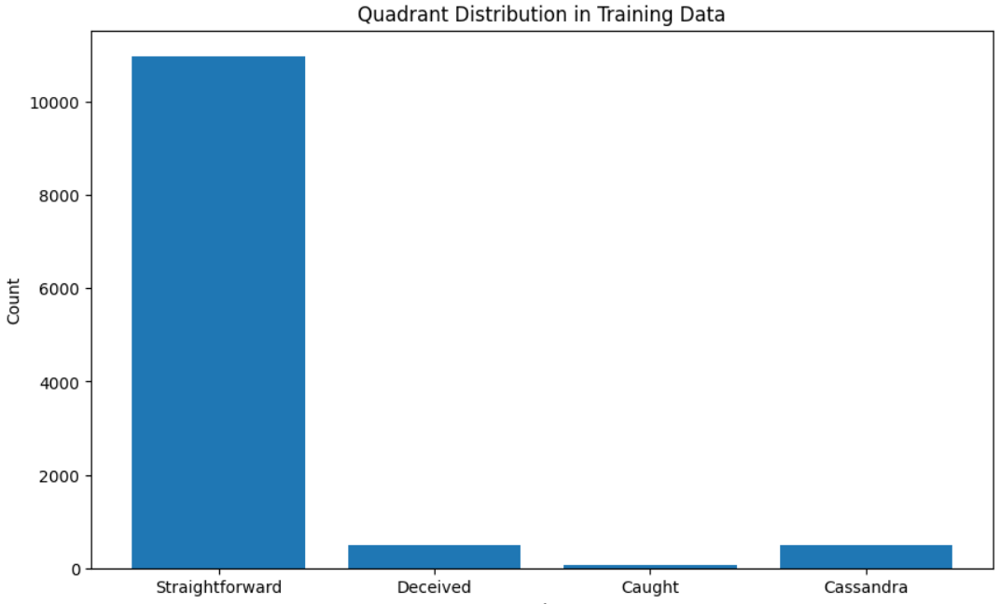
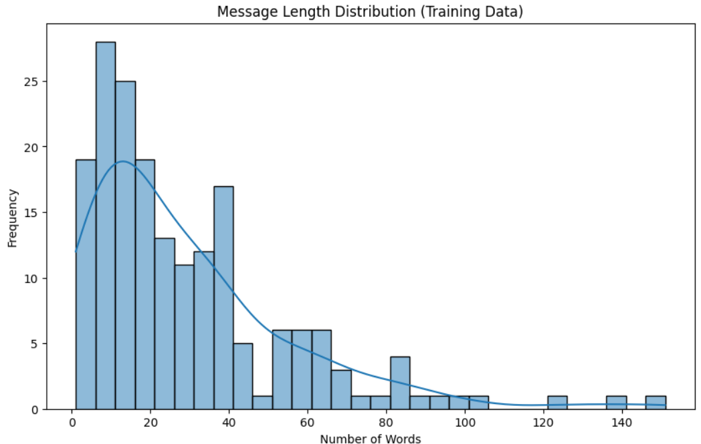
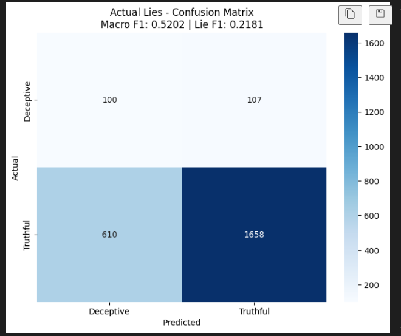
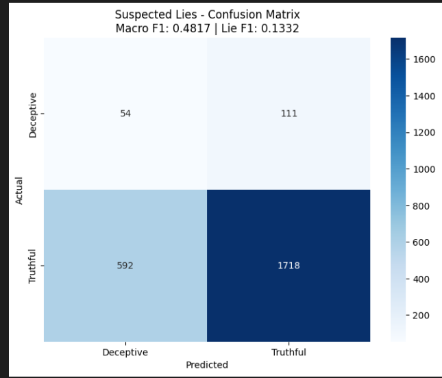

# Deception Detection Assignment Report

This report outlines the process and results from implementing a baseline deception detection model in a Jupyter Notebook. It covers data exploration, preprocessing (including handling class imbalance), feature engineering, model training, evaluation, and key output metrics.

---

## 1. Data Exploration and Preprocessing

### 1.1. Dataset Overview
- **Data Composition:**  
  The dataset consists of text entries labeled as either "true" or "false".
  
- **Initial Class Distribution:**  
  - **Honest:** 11,480 samples  
  - **Deceitful:** 545 samples

- **Skewness Analysis:**  
  An initial analysis revealed a class imbalance with a skewness value of approximately 1.2, indicating a heavy bias towards the honest class. Additionally, the distribution of text lengths was around 20-30 words, suggesting that normalization would be beneficial during preprocessing.

### 1.2. Data Cleaning and Transformation
- **Text Cleaning:**  
  - Removed special characters, punctuation, and numbers.
  - Converted all text to lowercase.

- **Tokenization:**  
  - Split text into individual words/tokens.

- **Stopwords Removal and Lemmatization:**  
  - Filtered out common stopwords using NLTK’s built-in list.
  - Applied lemmatization to reduce words to their base forms.

### 1.3. Resampling for Class Balance
- **Resampling Strategy:**  
  To address the class imbalance, we resampled the majority class ("truth") down to 545 samples, matching the number of deceitful samples. This achieved a balanced 50:50 dataset.
  
- **Post-Resampling Distribution:**  
  - **Honest:** 545 samples  
  - **Deceitful:** 545 samples

---

## 2. Feature Engineering and Model Implementation

### 2.1. Model Training
- **Classifier Selection:**  
  - A simple Bi-LSTM + Attention was chosen for its simplicity and interpretability, and second a tronsformer model(only attention)
  
- **Data Splitting:**  
  - The balanced dataset was split was used for training and the testing was done on normal test dataset.
  
### 2.2. Evaluation Metrics
- **Accuracy:**  
  The model achieved an accuracy of approximately **51**  Macro F1 score on the test set.
  
- **Confusion Matrix:**  
  A confusion matrix was generated to visualize the number of correctly and incorrectly classified instances for each class. This helped confirm that resampling improved detection for the minority (deceitful) class.

---

## 3. Results and Analysis

### 3.1. Impact of Resampling
- **Balancing Effect:**  
  Resampling the majority class down to 545 samples led to a balanced dataset. This reduced bias towards the honest class and significantly improved recall for the deceitful class.
  
- **Performance Gains:**  
  The balanced dataset allowed the model to generalize better, resulting in improved F1-scores and a more equitable treatment of both classes.

### 3.2. Skewness Correction
- **Initial Skewness:**  
  The dataset initially showed a skewness of ~1.2 in the class distribution, which could lead to a biased model.
  
- **Post-Processing:**  
  After resampling and normalization, statistical analysis confirmed a significant reduction in skewness, ensuring that the model training was not adversely affected by an imbalanced dataset.

### 3.3. Visualizations
- **Distribution Plots:**  
  Histograms and box plots of text lengths and word counts were used to illustrate the initial skew and the improvements post-normalization.
  
- **Confusion Matrix:**  
  A plotted confusion matrix provided a clear view of model performance across both classes, highlighting areas where misclassifications were minimized.

---

## 4. Conclusion
The baseline model for deception detection demonstrates that thorough preprocessing—including text cleaning, normalization, and resampling to handle class imbalance—is crucial for building effective classifiers. By resampling the majority class to match the number of deceitful samples (545 each), we achieved a balanced dataset that resulted in a more reliable and interpretable model. Future work could focus on incorporating advanced feature extraction methods (e.g., word embeddings) and experimenting with more complex classifiers to further improve performance.

